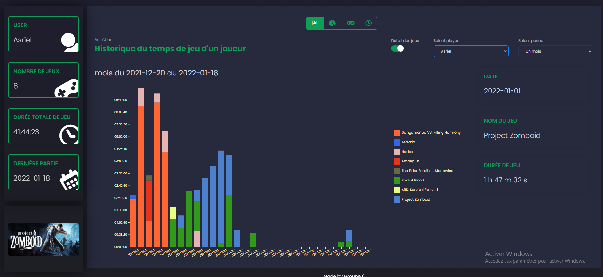

# Steam Gaming Time Visualization
```
Project made by group 6, at Lyon 1, in Data visualization course.

Tools for this project : Javascript (avec bibliothèque D3js), html/css, Python, Shell, Cron, Firebase Realtime Database, Steam API.
```



Link to datavisualization course : https://lyondataviz.github.io/teaching/lyon1-m2/2021/

### Questions our project will answer : 
+ How often do we play video games ?
+ Which person play the most ? (playing time comparison between each members of group 6)
+ Which cathegories are the most played ? What are the trends


### Our Visualizations 
* Link to Github pages : https://asriell.github.io/SteamGamingTimeVisualization/template/template/dashboard.html

+ Our visualizations are available, in the main branch, template folder :
  - Our javascript code is available in assets/js
  - Our css code  is available in assets/css/style.css
  - Our html code is available in template/dashboard.html
  - The json we used is at "https://github.com/Asriell/SteamGamingTimeVisualization/tree/main/data/steam-players-data.json", or in the folder ``/data/steam-players-data.json`` in main.

### Data Scraping 

Our scripts for the data scraping are in the folder scrapingScript. A readme is present for more informations.

#### Our VM for the data scraping
```
address : 192.168.74.201
password : steam
```


### About Steam API

##### Doc Steam API
Steam API Documentation : https://developer.valvesoftware.com/wiki/Steam_Web_API#GetGlobalAchievementPercentagesForApp_.28v0001.29
Steam API Other Documentation : https://steamcommunity.com/dev?l=french
##### Steam Key
For our requests, we need a key that we get by following this link : https://steamcommunity.com/dev/apikey


```
Group 6 members : Kerbouche Mahfoudh, Firmin-Pignot Jeff, Burdin Kevin, Garcia Gael
```
